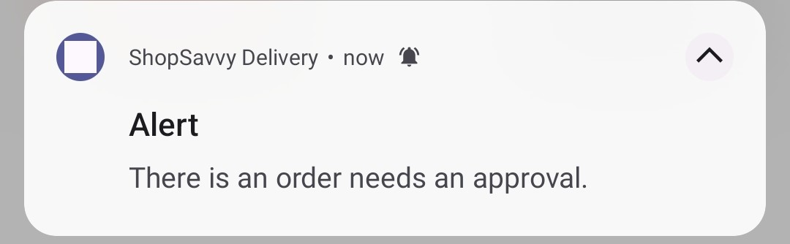
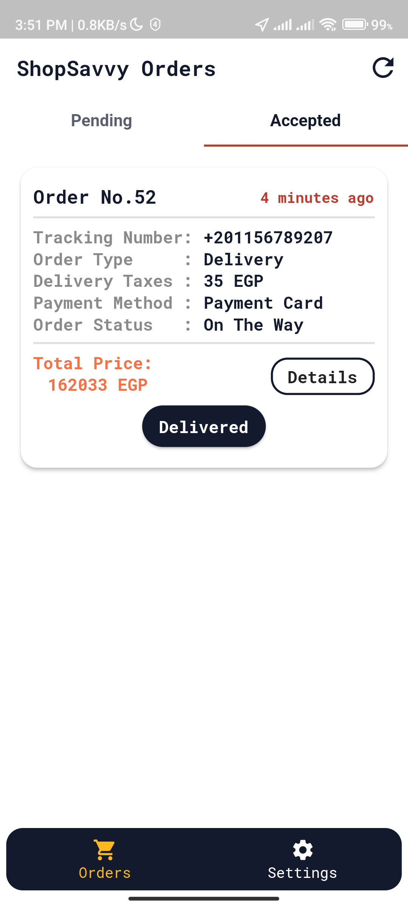

<h1 align="left">Hey 👋 What's up?</h1>

###

<h3 align="left">This is ShopSavvy E-Commerce Application [Admin & Delivery]</h3>

###

<h2 align="left">About The Application:</h2>

###

Flutter & GetX & PHP & MYSQL & Firebase Ecommerce Application
Used MVC Arch in this application
This application supports two language till now "AR & EN",
4 OnBoarding Pages - Firebase Phone & Email Auth with otp code.
another way for auth using php & MySql without sending email cause it needs money for hosting but i take the verify code locally
and the whole auth functions work perfectly in firebase and php Api.
in the future will implement social media SignIn & SignUp.
Forget Password Using phone and email for both firebase resetting by email link and phone otp
resetting password by email using php & MySql.
but now using only php api. but all firebase functions are available and ready to replace php.

###

<h2 align="left">Photos Of the App</h2>

  

    
    
    
    
  

  

    
    
    
    
  

  

    
    
    
    
  

  

    
    
    
    
  

  

    
    
    
  

###

<h2 align="left">Techs Used in this application:</h2>

###

  
  
  
  
  
  
  
  
  
  
  
  
  
  
  
  
  
  
  

###
